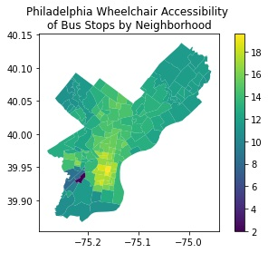

# Assignment 02: PostGIS Analytics
**Due: Oct 18, 2021 by 11:59pm ET**

## by Alexander Nelms
See the queries for more indepth discussions

## Questions

1. Which bus stop has the largest population within 800 meters? As a rough estimation, consider any block group that intersects the buffer as being part of the 800 meter buffer.

|stop_name             |estimated_pop_800m|the_geom|
|----------------------|-----------------:|---------|
|Passyunk Av & 15th St |             50,867|*Point*|

2. Which bus stop has the smallest population within 800 meters?

|stop_name             |estimated_pop_800m|the_geom|
|----------------------|-----------------:|---------|
|Charter Rd & Norcom Rd|                 2|*Point*|

3. Using the Philadelphia Water Department Stormwater Billing Parcels dataset, pair each parcel with its closest bus stop. The final result should give the parcel address, bus stop name, and distance apart in meters. Order by distance (largest on top).

| # |address              |stop_name                      |distance_m|
|---|---------------------|-------------------------------|---------:|
|1  |1431 W SOMERSET ST   |Broad St & Somerset St         |77.09|
|2  |1437 W SOMERSET ST   |Broad St & Somerset St         |91.72|
|3  |9101 FRANKFORD AVE   |Frankford Av & Tolbut St       |144.85|
|4  |193 W WINGOHOCKING ST|Wingohocking St & Rising Sun Av|63.58|
|5  |186 W ANNSBURY ST    |Wingohocking St & Rising Sun Av|80.13|

4. Using the _shapes.txt_ file from GTFS bus feed, find the **two** routes with the longest trips. In the final query, give the `trip_headsign` that corresponds to the `shape_id` of this route and the length of the trip.

|trip_headsign                 |trip_length   |
|------------------------------|------------:|
|Bucks County Community College| 46,504|
|Oxford Valley Mall            |43,658|

5. Rate neighborhoods by their bus stop accessibility for wheelchairs. Use Azavea's neighborhood dataset from OpenDataPhilly along with an appropriate dataset from the Septa GTFS bus feed. Use the [GTFS documentation](https://gtfs.org/reference/static/) for help. Use some creativity in the metric you devise in rating neighborhoods. Describe your accessibility metric:

PROCESS
To rate neighborhoods by their bus stop accessibility for wheelchairs, I formed
an accessibility metric that aggregated point ratings of three metrics:
1. Percent of Accessible Bus Stops where wheelchair boardings were possible (out of 10 points)
    (from the GTFS Google Bus Stops dataset of Philadelphia)
2. Bus Stops per square mile (out of 5)
    (area & aggregate based on OpenPhillyData's Neighborhood polygons)
3. Average Accessible Bus Stops per Square Mile of the neighboring neighborhood (out of 5)

The three metrics rate the accessibility of immediate bus stops and
the transit system at large. However, only on a surface level and there is a bias towards higher density areas 
(without considering the networks of the bus lines, transit system, and walking paths)

See this map of the bus stop metrics

6. What are the _top five_ neighborhoods according to your accessibility metric?

|accessibility_rank|neighborhood_name   |accessibility_metric|num_bus_stops_accessible|num_bus_stops_inaccessible|
|:----------------:|--------------------|------------------:|--------------:|-------------------------:|
|        1         |Washington Square West|               19.58|                      72|                         2|
|        2         |Hawthorne           |               19.18|                      30|                         0|
|        3         |Rittenhouse         |               18.54|                      99|                         4|
|        4         |Newbold             |               18.36|                      45|                         4|
|        5         |Bella Vista         |               18.09|                      25|                         0|

7. What are the _bottom five_ neighborhoods according to your accessibility metric?

|rank|neighborhood_name   |accessibility_metric|num_bus_stops_accessible|num_bus_stops_inaccessible|
|:----------------:|--------------------|-------------------:|-----------------------:|-------------------------:|
|       157        |Bartram Village     |                1.99|                       0|                        14|
|       156        |Paschall            |                7.98|                      32|                        38|
|       155        |Woodland Terrace    |                8.08|                       2|                         8|
|       154        |Southwest Schuylkill|                8.27|                      23|                        29|
|       153        |Kingsessing         |                8.64|                      37|                        32|

8. With a query, find out how many census block groups Penn's main campus fully contains. Discuss which dataset you chose for defining Penn's campus.

|upenn_count_block_groups      |
|------------------------------|
|36                            |

9. With a query involving PWD parcels and census block groups, find the `geo_id` of the block group that contains Meyerson Hall. ST_MakePoint() and functions like that are not allowed.

|geo_id                        |
|------------------------------|
|421010369001                  |

10. You're tasked with giving more contextual information to rail stops to fill the `stop_desc` field in a GTFS feed. Using any of the data sets above, PostGIS functions (e.g., `ST_Distance`, `ST_Azimuth`, etc.), and PostgreSQL string functions, build a description (alias as `stop_desc`) for each stop. Feel free to supplement with other datasets (must provide link to data used so it's reproducible), and other methods of describing the relationships. PostgreSQL's `CASE` statements may be helpful for some operations.

|stop_id|stop_name           |stop_desc                       |stop_lon   |stop_lat  |
|-------|--------------------|--------------------------------|-----------|----------|
|90221  |Manayunk            |Located at 4401 Cresson St      |-75.225    |40.0269444|
|90314  |49th Street         |Located at 1100 S 49th St       |-75.2166667|39.9436111|
|90320  |Forest Hills        |Located at 299 Byberry Rd       |-75.0205556|40.1277778|
|90321  |Somerton            |Located at 14021 Bustleton Ave  |-75.0119444|40.1305556|
|90401  |Airport Terminal E F|Located at 8500 Essington Ave   |-75.2397222|39.8794444|
